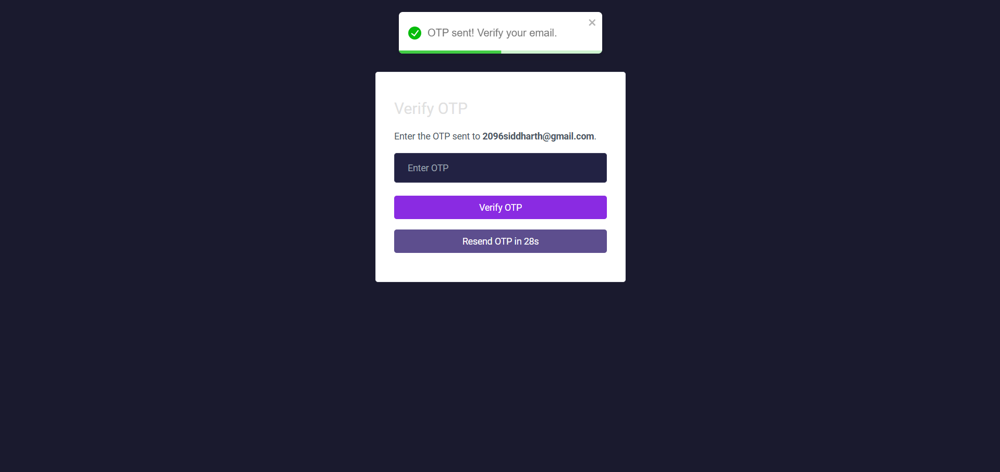
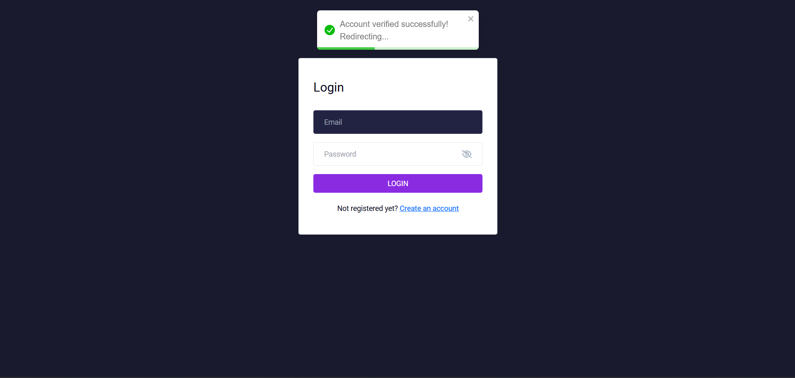
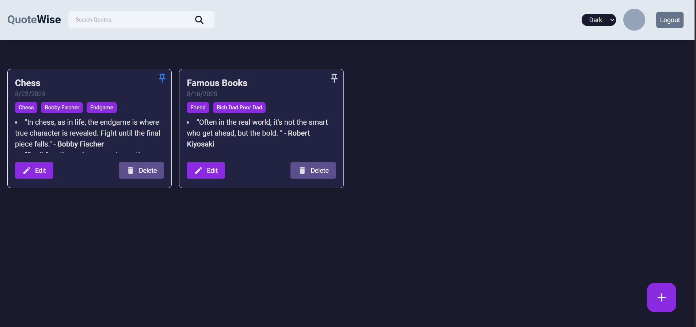
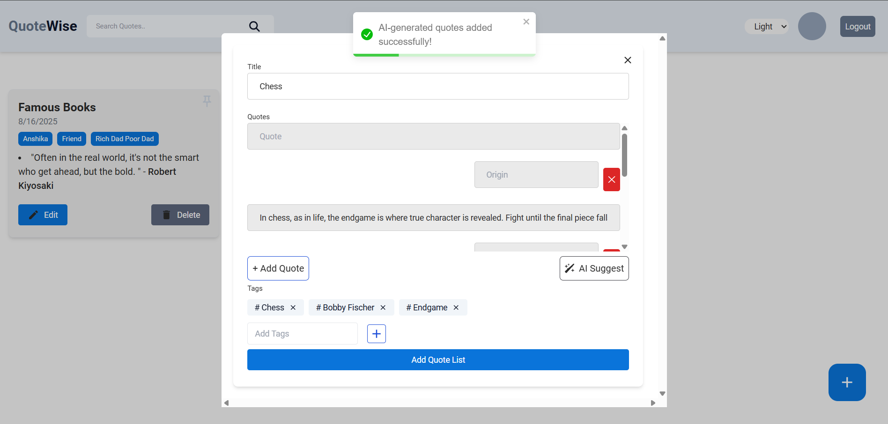
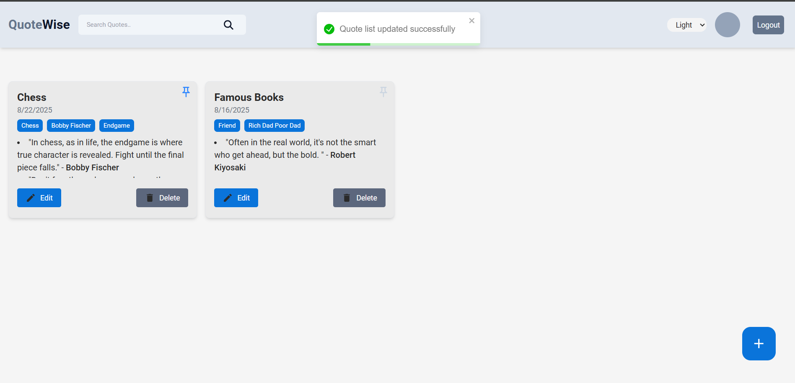

# 📖 QuoteWise

QuoteWise is a full-stack MERN application that helps users save, organize, and revisit their favorite quotes.  
It includes **secure authentication (OTP + JWT)**, **AI-powered quote suggestions (Gemini API)**, and automated **email reminders via cron jobs**.

🔗 **Live Demo**: [https://quote-wise-orpin.vercel.app](https://quote-wise-orpin.vercel.app)

---

## ✨ Features

- 🔐 OTP + JWT-based authentication
- 📚 Create, update, delete, and pin quote lists
- 🤖 AI-powered quote generation using Gemini API
- 📧 Automated daily email reminders (cron job at 10 AM IST)
- 🎨 Light & Dark theme support
- ⚡ Rate limiting for security against DoS attacks

---

## 🛠️ Tech Stack

- **Frontend**: React.js, Next.js, Tailwind CSS
- **Backend**: Node.js, Express.js
- **Database**: MongoDB
- **Auth**: JWT + OTP verification (Nodemailer)
- **APIs**: Gemini API
- **Hosting**: Vercel (frontend) + Render (backend/cron jobs)

---

## 📸 Screenshots

### 🔐 Authentication Flow

| Sign Up                       | OTP Sent                   | OTP Verification                  | Login                        |
| ----------------------------- | -------------------------- | --------------------------------- | ---------------------------- |
|  |  |  |  |

---

### 🏠 Home & Quotes Management

| Home Screen                        | AI-Generated Quotes                 | Light Theme                        |
| ---------------------------------- | ----------------------------------- | ---------------------------------- |
|  |  |  |

---

## 🚀 Getting Started

### Prerequisites

- Node.js >= 16
- MongoDB (local or Atlas)
- Gemini API key
- Email service (for OTP & cron jobs)

### Setup

```bash
# Clone repo
git clone https://github.com/your-username/quote-wise.git
cd quote-wise

# Install dependencies
npm install

# Setup environment variables
cp .env.example .env

# Run locally
npm run dev
```
